## **Spotify Wrapped: Detailed Overview.**

#### **Overview**

The objective of this **data analytics initiative** is to provide a **comprehensive analysis** of your **listening habits**. It highlights your **favorite** **songs**, **artists**, and the **genres** that influenced your year. This isn’t just a summary; it reveals your **listening patterns**, showcasing which artists and songs were your favorites **daily**. Additionally, it identifies any **discrepancies** between your perceptions and the **actual data**, as well as any **outliers** among your most-listened-to tracks, and more.

---

#### **Goals to be Completed:**

- Determine the **most listened-to artists/tracks overall** (measured in **minutes listened**).
- Analyze the **Over Time performance** of the artists and tracks that are most listened to overall.
- Identify how many times the most listened-to artists/tracks appeared in the **top monthly/weekly**.
- Visualized **how the trends** of the most listened-to artists/tracks **change over the course** of months/weeks.
- Compare the **overall top list** with the list of artists/tracks that have been **consistently listened to over** weeks/months. 

Are there any **outliers** in the overall top list?

---

#### **Get Your Data**

Spotify offers an option to request your **streaming history manually**.

**Steps to Download Your Data from Spotify:**

1. Go to the **[privacy page](https://www.spotify.com/ar/account/privacy/)** on the Spotify website.
2. Scroll down to the "**Download Your Data**" section.
3. **Uncheck** the "**Account Data**" box and **check** the "**Extended Streaming History**" box.
4. **Wait** for a confirmation **email** from Spotify.
5. In a couple of days, you will receive a new email from Spotify, where you can **download your data**.
6. That's it!

After obtaining your data, **replace my Spotify data** with the **new files** in the `/spotify_data`.

---

#### **Analyse the data.**

Check out the [notebook](https://) to see the research.

---

#### **Outcome of the basic goals to be achieved.**

#### **Determine the most listened-to artists/tracks overall (measured in *minutes listened*).**

---

- The Most Listened Artists Overall (measured in msPlayed).

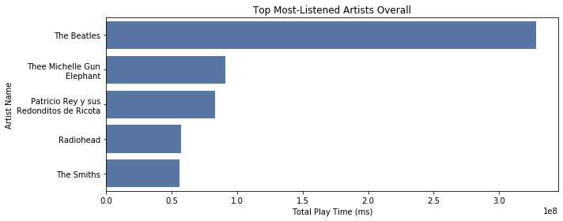

- The Most Listened Tracks Overall (measured in msPlayed).

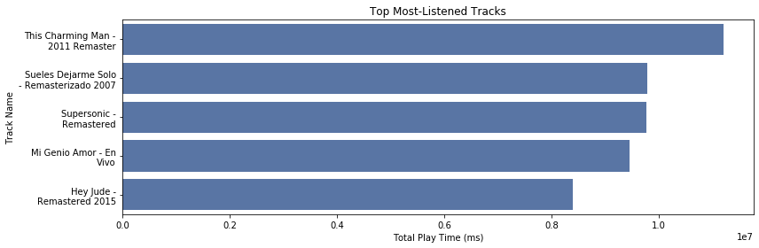

#### **Analyze the Over Time performance of the artists and tracks that are most listened to overall.**

---

- Performance Of The Most Listened Artists Over Time.

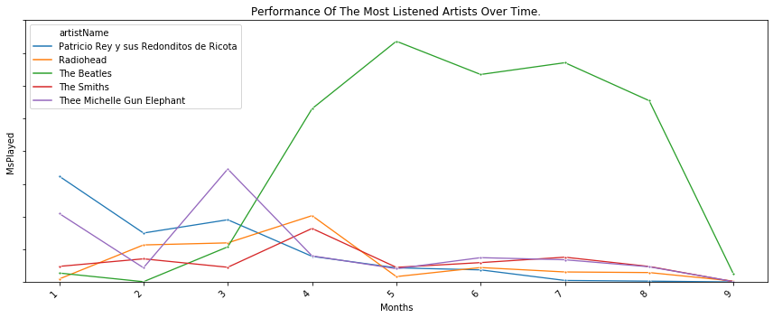

- Performance Of The Most Listened Tracks Over Time.

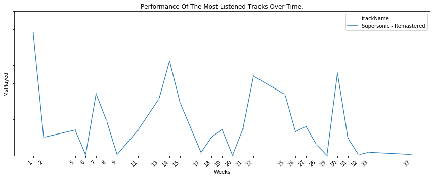
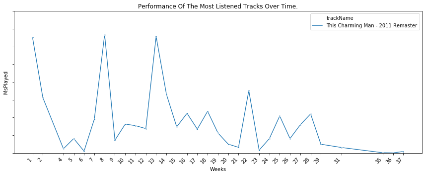
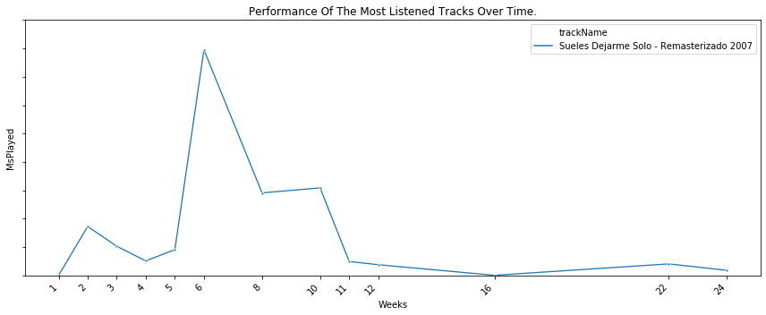
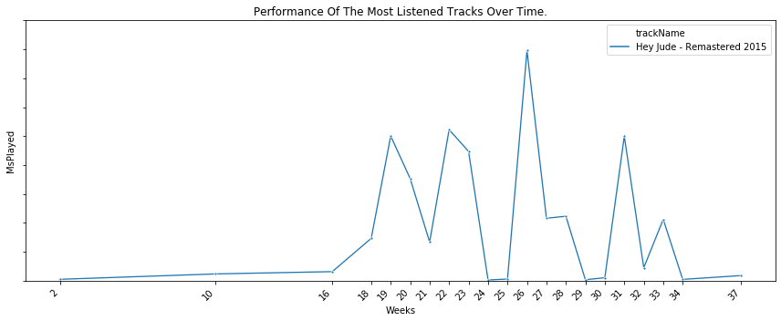
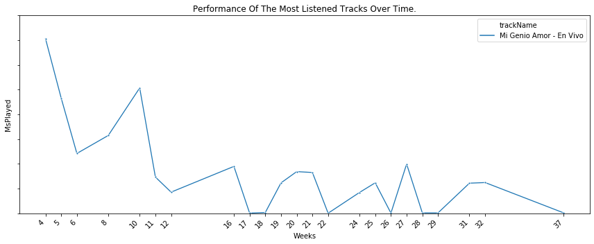

#### **Visualized how the trends of the most listened-to artists/tracks change over the course of months/weeks.**

---

- Performance Of The Most Llistened Artists By Top Monthly Over Time.

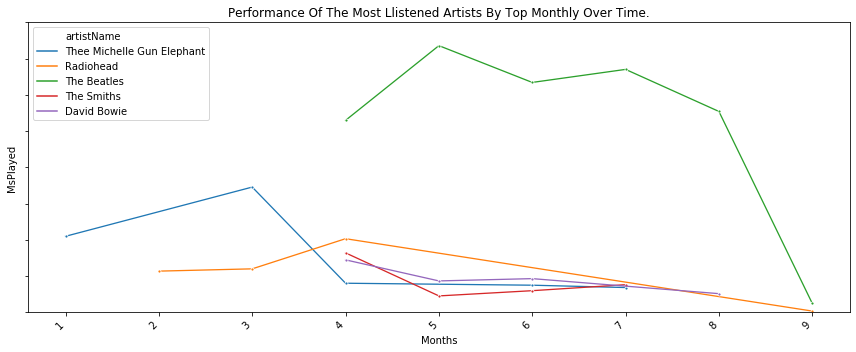

- Performance Of The Most Llistened Tracks By Top Weekly Over Time.

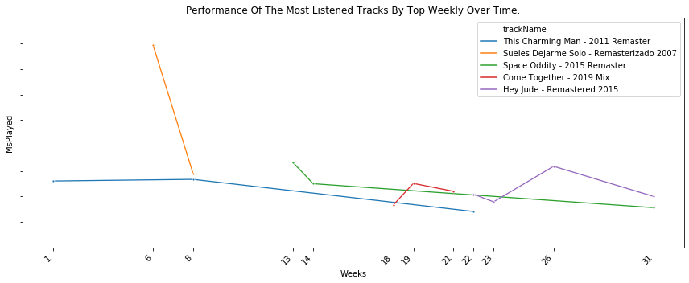

#### **Compare the overall top list with the list of artists/tracks that have been consistently listened to over weeks/months.** 

---

- Artists Who Entered And Exited The Top After Using Monthly Charts.
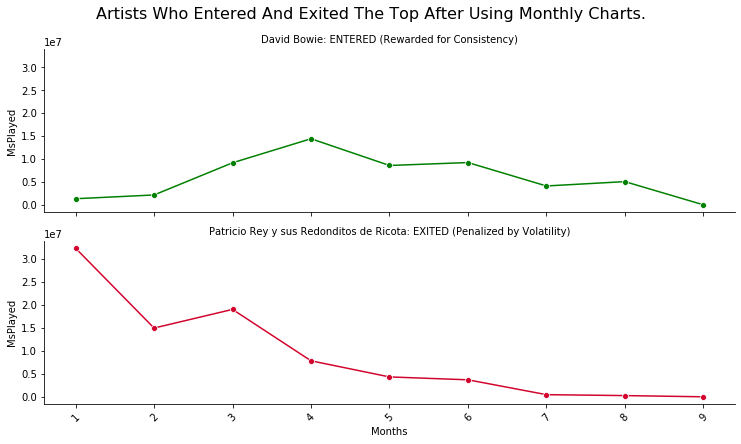

- Artists Who Entered And Exited The Top After Using Monthly Charts.
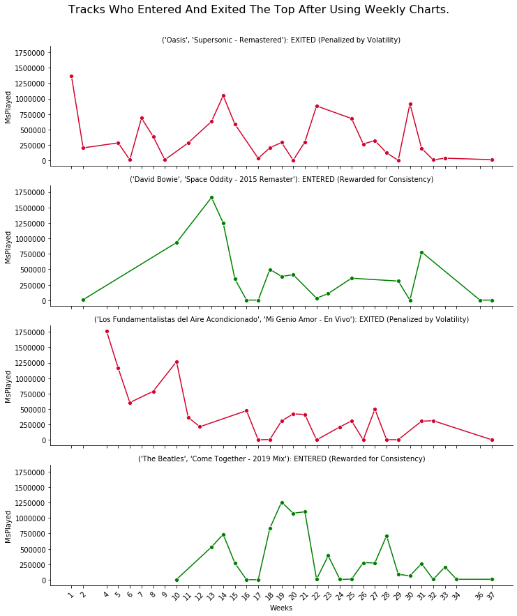

---

#### **First Impressions**:

- The top **five artists** were responsible for **approximately 25%** of the **total listening time this year to date.**
- In **contrast**, the **top five most-listened tracks** accounted for **only 2%** of the **overall listening time year to date.**
- The dataframe includes **37 weeks** of listening history; however, **only two or three weeks** in the **weekly top chart** are **necessary** to **rank tracks consistently.**

---

#### **Initial conclusion**: 

- **More reliable methods are necessary** to identify the "*most consistently played*" tracks rather than just counting their appearances in weekly or monthly top charts.

---