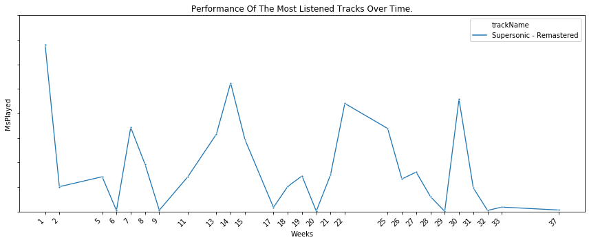
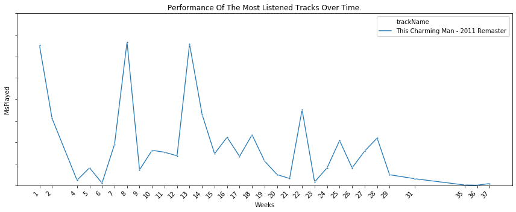
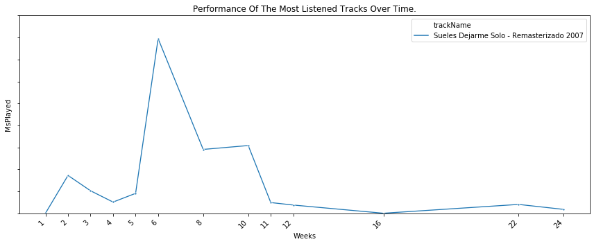
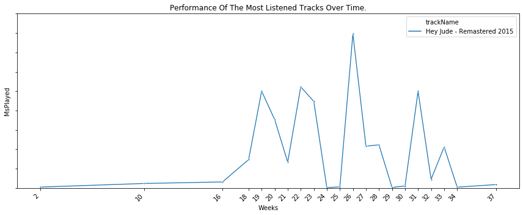
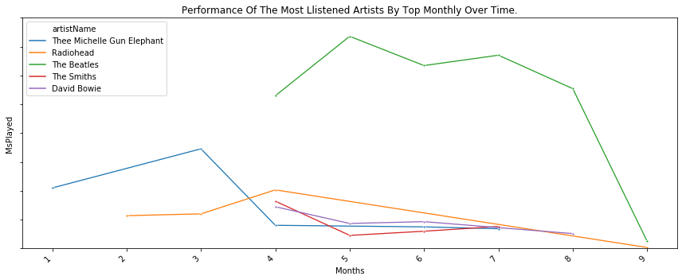
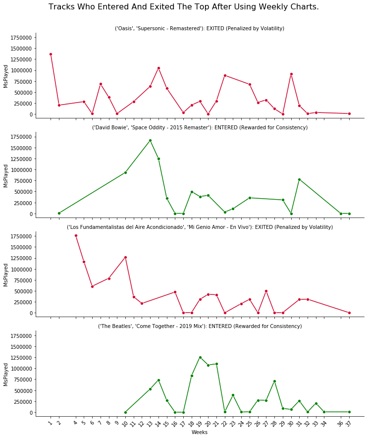

### Outcome of the basic goals to be achieved.

#### **Analysis Period:** From January 6, 2025, to September 20, 2025 (a total of 257 days).

---

### **Goals to be Completed:**

- Determine the **most listened-to artists/tracks overall** (measured in **minutes listened**).
- Analyze the **monthly performance** of the artists and tracks that are most listened to overall.
- Identify how many times the most listened-to artists/tracks appeared in the **top monthly/weekly**.
- Visualized **how the trends** of the most listened-to artists/tracks **change over the course** of months/weeks.
- Compare the **overall top list** with the list of artists/tracks that have been **consistently listened to over** weeks/months. Are there any **outliers** in the overall top list?

---

### **Determine the *most listened-to artists/tracks overall* (measured in *minutes listened*).**

---

- **The Most Listened Artists Overall (measured in msPlayed).**

- **The Most Listened Tracks Overall (measured in msPlayed).**

### **Analyze the *Over Time performance* of the artists and tracks that are most listened to overall.**

---

- **Performance Of The Most Listened Artists Over Time.**

- **Performance Of The Most Listened Tracks Over Time.**

### Visualized **how the trends** of the most listened-to artists/tracks **change over the course** of months/weeks.

---

- **Performance Of The Most Llistened Artists By Top Monthly Over Time.**

- **Performance Of The Most Llistened Tracks By Top Weekly Over Time.**

### Compare the **overall top list** with the list of artists/tracks that have been **consistently listened to over** weeks/months. 

---

- **Artists Who Entered And Exited The Top After Using Monthly Charts.**

- **Artists Who Entered And Exited The Top After Using Monthly Charts.**

## First Impressions:
---
- The top `five artists` were responsible for `approximately 25%` of the `total listening time this year to date.`
- In **contrast**, the **top five most-listened tracks** accounted for **only 2%** of the **overall listening time year to date.**
- The dataframe includes **37 weeks** of listening history; however, **only two or three weeks** in the **weekly top chart** are **necessary** to **rank tracks consistently.**

Initial conclusion: 
- **More reliable methods are necessary** to identify the "*most consistently played*" tracks rather than just counting their appearances in weekly or monthly top charts.

---

### **New goal:** Is there a way to **measure the stability** of a **track** on a **week-to-week** basis?

### **First Model: Simple Exponential Smoothing (SES)**

**Why SES?**  because it functions as a **Long Memory Filter**, assigning **less weight** to the **current month** and **more weight** to historical data. This approach enables the model to disregard impulsive spikes and measure an artist's **momentum** and long-term loyalty.

- **Top Constant Tracks (using `SES`)**

- **Is "Sueles Dejarme Solo" one of my most consistently listened to tracks?**

The **track "Sueles Dejarme Solo" sees a nearly complete drop** in my **weekly listeners** after **week 13**. The **total number of streams** over those weeks creates a **pronounced "tail"** in the **smoothed average**, which **surpasses many songs** that have been listened to **more consistently** throughout the year. So, it **stands out** as an **outlier** at the top of the **list of consistently popular songs.**

---

Using only the SES model, **outliers continue to drop out of the top constant listened rankings.**

---

After several attempts, I decided to use this model to measure and rank **consistency, volatility, and relevance:**
$$\mathbf{P_{Final}} = S_{t_{\text{norm}}} \times \left( \frac{1}{1 + \sigma_{\text{norm}}} \right) \times (\text{Total}_{\text{norm}}) \times \text{Decay}_{\text{Factor}}$$

The steps outlined below explain the implementation process and provide the rationale for each model parameter.

---

### **Why were these parameters used in the calculation?**

### 1. **Simple Exponential Smoothing ($S_{t}$)**:
- **Advantage**: As we saw before,  it functions as a **Long Memory Filter**, assigning **less weight** to the **current month** and **more weight** to historical data. This approach enables the model to disregard impulsive spikes and measure a track's **momentum** and long-term loyalty.
- **Disadvantage**: While SES smooths out peaks, it does not penalize them adequately. This means that a track known for its volatility may still exhibit a pronounced historical trend in cumulative consumption.

---

### **2. Penalizing Volatility with Standard Deviation (σ)**:

**Why standard deviation?**
The standard deviation measures **how far individual values** in a data set typically deviate from the mean (average).
- A **high standard deviation** (σ) indicates that the data points are widely dispersed and far from the average, suggesting **high volatility** or inconsistent patterns.
- A **low standard deviation** (σ) shows that the data points are close to the average, indicating **low volatility** or consistent patterns.

**In this case, a low standard deviation is desirable because it reflects a regular consumption pattern.**

- **Advantage**: The standard deviation is a direct measure of volatility.
- **Disadvantage**: Consistency does not equal relevance. Using the standard deviation alone does not ensure that a track is genuinely significant. For instance, a track with a perfectly consistent pattern, even if it has very low consumption levels, could still rank highly.

---

Although the parameters addressed issues of **volatility** (σ) and **irrelevance** (total), an unresolved problem emerged: **Abandonment**.

For example, a song that had consistent consumption early in the year (like Soda Stereo's "Sueles Dejarme Solo") could rank highly because:
- It cultivated a **strong initial habit** ($S_t$ high).
- Its decline was **smooth** and non-volatile, resulting in a **low risk factor** (σ).

The previous parameters rewarded the recall of habits without penalizing prolonged abandonment, which indicates a lack of relevance. 

To address this, a **decay penalty factor** has been introduced. 

This adjustment ensures that the maximum score is awarded only to those who demonstrate **high consistency**, **low volatility**, and **no extended periods of abandonment.**

---

### **3. Sum of msPlayed (Total)**:
- **Advantage**: This metric helps ensure that consistency remains at a relevant level.

---

### **4. Normalization (norm)**

Normalization converts the original values—such as "msPlayed" in milliseconds, which can range from 0 to 1,000,000—into a new scale that ranges from **0 to 1.**

Without normalization, the metric with the largest absolute value (likely msPlayed) **would overshadow the others**, rendering SES and σ irrelevant.

The **Min-Max Scaling** technique will be used.

**Normalization Logic:**

- A value of 1 indicates the **highest stability** in habits or the **loudest listening volume** across the entire data frame.
- A value of 0 signifies the **highest volatility**, representing the most erratic pattern in the entire data frame.
---

### **5. Calculate the Decay Factor**

Although the parameters addressed issues of **volatility** (σ) and **irrelevance** (total), an unresolved problem emerged: **Abandonment**.

For example, a song that had consistent consumption early in the year (like Soda Stereo's "Sueles Dejarme Solo") could rank highly because:
- It cultivated a **strong initial habit** ($S_t$ high).
- Its decline was **smooth** and non-volatile, resulting in a **low risk factor** (σ).

The **previous parameters rewarded the recall of habits without penalizing prolonged abandonment**, which indicates a lack of relevance. 

To address this, a **decay penalty factor** has been introduced. 

This adjustment ensures that the maximum score is awarded only to those who demonstrate **high consistency**, **low volatility**, and **no extended periods of abandonment.**

This calculation is used to penalize a sustained decrease in consumption toward the end of the analysis period.

The **decay factor is determined by comparing** the **maximum level of stability** a song has reached (**its smoothed peak**) with its **current level of stability (its value from the last week)**.

---

#### **How does the penalty work?**

- If consumption **remains constant and has not decreased**, the final value ($St_{final}$) will be **very close to its peak** ($St_{peak}$). In this case, the **decay factor will be close to 1**, meaning the final score is **not penalized**.

- Conversely, if a song experienced **high consumption at the beginning but was completely abandoned later** (resulting in the final value being **almost zero or very low**), the **decay factor will be very small**, leading to a **significant penalty on the final score.** 

**This calculation should penalize songs like the Soda Stereo song**, where **consumption peaked early, and the final value dropped close to zero**.

---

### **Calculation of the Final Score ($P_{Final}$)**

$$\mathbf{P_{Final}} = S_{t_{\text{norm}}} \times \left( \frac{1}{1 + \sigma_{\text{norm}}} \right) \times (\text{Total}_{\text{norm}}) \times \text{Decay}_{\text{Factor}}$$

---

### Formula explanation:

| Symbol | Component | Function in the Model |
| :--- | :--- | :--- |
| $\mathbf{P_{Final}}$ | Final Score | The **Adjusted Ranking** for Sustained Consistency. |
| $S_{t_{\text{norm}}}$ | **Quality Base (SES)** | Measures **Inertia** and **Habit Stability** (the quality of the pattern). |
| $\sigma_{\text{norm}}$ | **Volatility (Standard Deviation)** | Measures the **Risk** that consumption was impulsive or erratic. |
| $\left( \frac{1}{1 + \sigma_{\text{norm}}} \right)$ | **Risk Factor** | The **Discount** that directly penalizes the volatile artist. |
| $\text{Total}_{\text{norm}}$ | **Relevance Factor** | Ensures the artist has the **Minimum Volume** necessary to compete. |
| $\text{Decay}_{\text{Factor}}$ | **Decay Penalty Factor** | Penalizes the habit's sustained **abandonment**. |

---

The result of this calculation will reward only songs that demonstrate **high pattern quality** ($S_t$), **low volatility** (low $\sigma$), **high consumption** (total), and **no sustained dropout** (High $Decay_{Factor}$).

---

### **Final Ranking: Top Tracks Based on Sustained Habit Score**

- **Final Ranking: Top Tracks Based on Sustained Habit Score**

- **📈 Visualization: Representation of the contribution of the factors to the Sustained Habit Score.**

### Analysis of the Contributions of  Factors to the Final Rankings by Tracks:

#### - This Charming Man - 2011 Remaster:

| Factor| Normalized Value| Interpretation |   
|:---|:---|:--- |
| Inertia ($S_t$) |	1.000 |	Indicates maximum stability, representing the strongest habit in the data set. |
| Risk Factor (Baja σ)| 0.666 | Reflects low risk, suggesting very stable consumption patterns. |
| Decay Factor (No Abandonment)| 0.100	| **Maximum Penalty:** Indicates that the habit was abandoned or was not active at the end. |

#### - Supersonic - Remastered:  

| Factor| Normalized Value| Interpretation |     
|:---|:---|:--- |
| Inertia ($S_t$) |	0.905 |	Indicates a very strong habit, slightly weaker than the first one. |
| Risk Factor (Low σ)| 0.674 | Represents very low risk; reflects a highly consistent listening pattern. | 
| Decay Factor (No Abandonment)| 0.100	| **Maximum Penalty:** This indicates that the habit was either abandoned or not active at the end. |

#### - I Saw Her Standing There - 2023 Mix: 

| Factor| Normalized Value| Interpretation | 
|:---|:---|:--- |
| Inertia ($S_t$) |	0.510 |	Indicates moderate listening habits in terms of volume. |
| Risk Factor (Low σ)| 0.725 | **Most consistent.** Demonstrates the **least volatility** (most uniform) in listening patterns among all the songs. |
| Decay Factor (No Abandonment)| 0.171	| Reflects a high penalty; however, it is **slightly better** than the previous two factors due to lower abandonment rates. |

#### - Hey Jude - Remastered 2015:  

| Factor| Normalized Value| Interpretation |  
|:---|:---|:--- |
| Inertia ($S_t$) |	0.574 |	 Indicates a moderate to strong habit. | 
| Risk Factor (Low σ)| 0.646 | Represents low risk and a stable pattern. |
| Decay Factor (No Abandonment)| 0.147	| Reflects a high penalty for obvious abandonment. |

#### - Mi Genio Amor - En Vivo:  

| Factor| Normalized Value| Interpretation | 
|:---|:---|:--- |
| Inertia ($S_t$) |	0.661 |	Indicates a strong habit, surpassing the previous two in terms of volume and inertia. |
| Risk Factor (Low σ)| 0.639 | Represents low risk and a stable pattern. |
| Decay Factor (No Abandonment)| 0.100	| **Maximum Penalty:** This indicates that the habit was either abandoned or not active at the end. |

### **Key Findings from the Contribution of Factors to the Final Ranking by Tracks.**

**The Song with the Best Risk Pattern**

- **'I Saw Her Standing There'** has the highest $Risk_{Factor}$ of **0.725**, indicating it has the **most consistent and least volatile** weekly listening pattern among the five songs.

**The Correlation Problem**

- The fact that "This Charming Man" and "Supersonic" have $S_{t \text{ norm}}$ values of 1.0 and 0.9, respectively, shows they exhibited a strong habit inertia. However, the level of abandonment was so complete that they both fell to the minimum penalty value.

---

### **Final Ranking: Top Artists Based on Sustained Habit Score**

- **📈 Visualization: Representation of the contribution of the factors to the Sustained Habit Score.**

### Analysis of the Contributions of Various Factors to the Final Rankings by Artists:

#### - The Beatles:

| Factor| Normalized Value| Interpretation |   
|:---|:---|:--- |
| Inertia ($S_t$) |	1.000 |	**Maximal Habit Quality.** This is the artist with the strongest, most consistent long-term listening pattern. |
| Risk Factor (Baja σ)| 0.500 | **Moderate Volatility.** Their listening pattern is somewhat erratic, indicating spikes in consumption. |
| Decay Factor (No Abandonment)| 0.225	| **Significant Abandonment.** The habit was strong but has significantly decayed or was not active towards the end of the analysis period. |

#### - Thee Michelle Gun Elephant:  

| Factor| Normalized Value| Interpretation  |    
|:---|:---|:--- |
| Inertia ($S_t$) |	0.299 |	**Low Habit Quality.** Their overall listening level is relatively low compared to the top artist. |
| Risk Factor (Low σ)| 0.683 | **Low Risk.** Highly stable listening pattern, much more uniform and less volatile than The Beatles. |
| Decay Factor (No Abandonment)| 0.100	| **Maximum Penalization.** The habit has been almost completely abandoned.|

#### - Patricio Rey y sus Redonditos de Ricota: 

| Factor| Normalized Value| Interpretation | 
|:---|:---|:--- |
| Inertia ($S_t$) |	0.263 |	**Low Habit Quality.** |
| Risk Factor (Low σ)| 0.713 | **Lowest Risk.** This artist has the most uniform and consistent weekly listening pattern of all five. |
| Decay Factor (No Abandonment)| 0.100	| **Maximum Penalization.** The habit has been almost completely abandoned. |

#### - The Smiths:  

| Factor| Normalized Value| Interpretation |  
|:---|:---|:--- |
| Inertia ($S_t$) |	0.197 |	 **Lowest Habit Quality.** Relatively low overall long-term consumption. | 
| Risk Factor (Low σ)| 0.863 | **Very Low Risk.** Exceptionally stable and uniform listening pattern. This is a highly reliable background or consistent rotation artist. |
| Decay Factor (No Abandonment)| 0.100	| **Maximum Penalization.** The habit has been almost completely abandoned. |

#### - Radiohead:  

| Factor| Normalized Value| Interpretation | 
|:---|:---|:--- |
| Inertia ($S_t$) |	0.181 |	**Lowest Habit Quality.**  | 
| Risk Factor (Low σ)| 0.790 | **Low Risk.** Highly stable listening pattern. |
| Decay Factor (No Abandonment)| 0.100	| **Maximum Penalization.** The habit has been almost completely abandoned. |

### Key Findings from the Contribution of Factors to the Final Ranking by Artists.

**The Dominance of Volatility for The Beatles**
- **The Beatles** lead the Inertia rank but have the lowest **Risk Factor** among the group, meaning their habit is the **most volatile**. This is consistent with an artist having massive, but somewhat erratic, listening events.
- In contrast, *The Smiths*, *Radiohead*, and *Patricio Rey*  all show significantly smoother, **less volatile listening patterns**.

**Final Ranking Implications**
The final artist ranking is a balance of all factors, and in this case, the **Final Score** will be dominated by the least penalized Decay Factor, combined with high Inertia.
- **The Beatles** will likely win: Their **perfect Inertia** combined with a **Decay Factor** that is more than double the others is mathematically overpowering.
- *The Smiths and Radiohead*, **despite their perfect Volatility scores** (very stable listening patterns), will fall to the bottom due to their **low Inertia** and maximum **Abandonment penalty**.